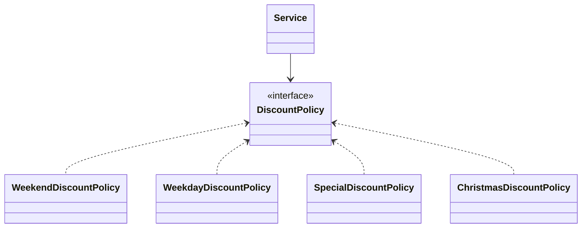

# 기능 명세서📋

## 입출력 요구 사항 
- [ ] : 방문 날짜
  - [ ]  (출력) 12월 중 식당 예상 방문 날짜는 언제인가요? (숫자만 입력해 주세요!)
  - [x]  1 이상 31이하 숫자만 받도록 설정
  - [x] (예외 처리-범위제한) [ERROR] 유효하지 않은 날짜입니다. 다시 입력해 주세요.
####
- [ ] 안내메시지 
  - [x] (출력 - 맨 위) 안녕하세요! 우테코 식당 12월 이벤트 플래너입니다.
  - [x] (출력 - 모두 입력 후) 12월 26일에 우테코 식당에서 받을 이벤트 혜택 미리 보기!
####
- [ ] 메뉴
  - [x] (출력) 주문하실 메뉴와 개수를 알려 주세요.
  - [ ] (예외 처리-메뉴없음) [ERROR] 유효하지 않은 주문입니다. 다시 입력해 주세요.
  - [ ] (예외 처리-메뉴 개수 범위제한) [ERROR] 유효하지 않은 주문입니다. 다시 입력해 주세요.
  - [ ] (예외 처리-메뉴 형식 제한) [ERROR] 유효하지 않은 주문입니다. 다시 입력해 주세요.
  - [ ] (예외 처리-메뉴 중복 제한) [ERROR] 유효하지 않은 주문입니다. 다시 입력해 주세요.
  - [ ] (출력) 받은 주문 메뉴 출력 순서 자유롭게 
####
- [ ] 배지
  - [ ] (출력) 금액에 따른 배지 출력 
####
- [ ] 혜택금액 
  - [ ] 증정메뉴 가격 + 할인메뉴 가격
  - [ ] (출력) 없으면 0원 출력 
  - [ ] (출력)  출력 금액은 3자리 수 "," 포함
####
- [ ] 할인 금액
  - [ ] (출력) 할인 후 예상 금액 = 할인 전 예상 금액 - 할인금액
  - [ ] (출력) 출력 금액은 3자리 수 "," 포함 
####
- [ ] 증정 메뉴
  - [ ] (출력) 메뉴출력 없으면 "없음" 출력

####
- [ ] 혜택 내역
  - [ ] (출력) 할인 이벤트 등 적용된 혜택 내역 출력
  - [ ] (출력) 없으면 "없음" 출력
  - [ ] 순서 상관없음
####
 - [ ] 이벤트 뱃지
   - [ ] (출력) 없으면 "없음" 출력
 

 

## 핵심 기능 요구 사항
- [ ] 할인 구현  - 중복할인이 가능하다. 
####
- [ ] 이벤트 기간 : 2023.12.1~2023.12.25
  - [ ] 크리스마스 디데이 할인 
  - [ ] 1,000으로 시작 하루마다 100원씩 증가 할인
####
  - [ ] 이벤트 기간: 2023.12.1 ~ 2023.12.31
    - [ ] 평일 할인 : 디저트 개당 2023원 할인
    - [ ] 주말 할인 : 메인 메뉴 개당 2023원 할인 
    - [ ] 특별 할인 :(별이 있는 날) 총주문 1000원 할인 
    - [ ] 증정이벤트 구현  : 총 주문 12만원 이상, 샴페인 증정
####
- [ ] 이벤트 배지 구현 
  - [ ] 5천 원 이상 : 별
  - [ ] 1만 원 이상 : 트리
  - [ ] 2만 원 이상 : 산타

 
  

## 프로그래밍 요구 사항
- [ ] 메뉴 Emum으로 제공
- [ ] InputView , OutputView 사용 
- [ ] 입력 오류 시 IllegalArgumentException 발생 
- [ ] 입력 오류 시 "[ERROR]"로 시작하는 에러 메시지를 출력 

# 클래스 구조도

